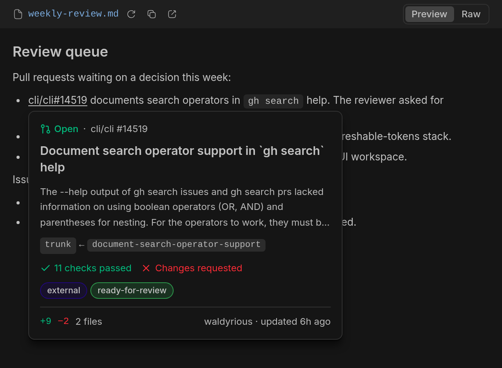
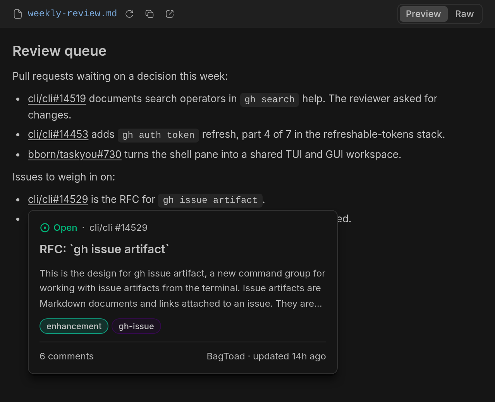

# Link Hovercards

A [BB](https://getbb.app) plugin. Rest the pointer on a GitHub or Linear link
anywhere in BB, or long-press it on a touch screen, and a card shows what it
points at. You don't have to leave the thread.

<p>
  
  
</p>

| Link | The card shows |
| --- | --- |
| GitHub pull request | open / draft / merged / closed, title, description, base ← head, CI checks, review decision, merge conflicts, labels, lines changed, files, author, last activity |
| GitHub issue | open / closed / not planned, title, description, labels, comments, assignees, author, last activity |
| Linear issue | workflow state, team, title, description, priority, project and cycle, due date, labels, linked pull requests, assignee, last activity |

It recognizes `https://github.com/<owner>/<repo>/pull/<n>`,
`https://github.com/<owner>/<repo>/issues/<n>` and
`https://linear.app/<workspace>/issue/<ID>` links in chat messages, plans,
panels and every other part of the app.

## Install

```
bb plugin install git:https://github.com/bborn/bb-plugin-link-hovercards.git
```

Or install **Link Hovercards** from the BB Community marketplace.

## Requirements

- **BB 0.44 or newer** (plugin SDK 0.5.29+).
- **GitHub:** the [GitHub CLI](https://cli.github.com) signed in (`gh auth login`)
  on the machine that runs the BB server. Cards show what that account can see.
- **Linear (optional):** a personal API key from Linear → Settings → Security &
  access, pasted into **Settings → Plugins → Link Hovercards → Linear API keys**.
  A key belongs to one workspace, so separate several with commas. The plugin
  works out which key belongs to which workspace.

## Behavior

- A card opens after the pointer rests on a link for about a third of a second.
  Moving the pointer into the card keeps it open, so you can click the title.
- On touch screens, holding a link for about 0.4 seconds opens the card. A normal
  tap still follows the link.
- Escape, clicking elsewhere, moving away, or scrolling the link off screen
  closes it. While a thread scrolls itself as messages stream in, the card
  moves with its link.
- Answers are cached for a minute. Errors are cached for ten seconds.

## How it works

- `app.tsx` registers one `experimental_appOverlay` that watches pointer events
  on the document and portals the card into the page.
- `server.ts` answers the `github` and `linear` RPCs, and caches answers and
  shares identical requests that are still in flight. Linear keys are secret
  settings and never reach the browser.
- `host.ts` runs `gh pr view` and `gh api` on the BB server's machine, because a
  plugin server entry can't start processes.

## Develop

```
npm install
npm test
npm run typecheck
bb plugin install .
bb plugin build && bb plugin reload link-hovercards
```

## License

MIT
